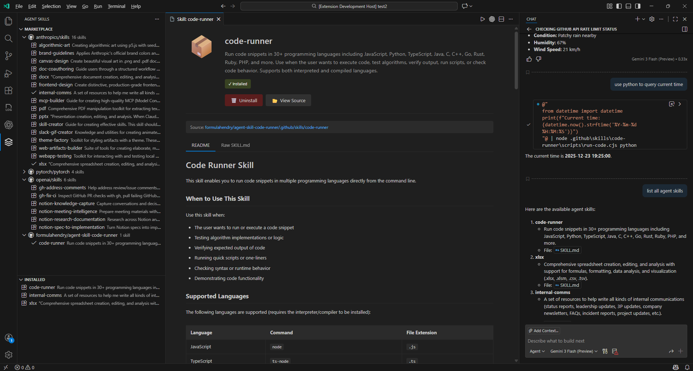

# Agent Skills Marketplace for VS Code

A VS Code extension that provides a marketplace for discovering, installing, and managing [Agent Skills](https://agentskills.io) - reusable tools and capabilities for AI agents and Claude assistants.

## Features

- **📦 Skill Marketplace**: Browse and discover skills from multiple GitHub repositories
- **🔍 Search**: Quickly find skills by name or keyword
- **⚡ One-Click Install**: Install skills directly into your workspace
- **📋 Installed Skills**: View and manage all skills installed in your workspace
- **📖 Rich Documentation**: View detailed skill information with markdown rendering including tables and code blocks
- **🔄 Sync Management**: Automatic synchronization between marketplace and installed skills
- **⚙️ Configurable Sources**: Add custom GitHub repositories as skill sources
- **🔐 GitHub Token Support**: Optional personal access token for higher API rate limits

## Screenshots



*Agent Skills Marketplace interface showing the skill marketplace and installed skills views*

## Installation

1. Open VS Code
2. Go to Extensions (Ctrl+Shift+X / Cmd+Shift+X)
3. Search for "Agent Skills"
4. Click Install

## Quick Start

### Browse Skills

1. Open the Agent Skills panel in the Activity Bar (the skill icon)
2. Click on **Marketplace** tab to see all available skills
3. Skills are grouped by source repository for easy browsing

### Search Skills

1. Click the **Search** icon (🔍) in the Marketplace view title bar
2. Enter a skill name or keyword
3. Results update in real-time
4. Click the **Clear Search** icon (✕) to return to the full list

### Install a Skill

1. In the Marketplace, find the skill you want to install
2. Click the **Install** button (⬇️) or the info icon (ℹ️) to view details
3. In the detail view, click **Install** button
4. The skill will be downloaded and installed to your workspace

### View Skill Details

Click the **info icon** (ℹ️) next to any skill in the marketplace to open a detailed view with:
- Full description and documentation
- License and compatibility information
- Installation status badge
- Install/Uninstall buttons
- View Source button to see the skill on GitHub

### Manage Installed Skills

1. Click on **Installed** tab to see your installed skills
2. For each installed skill, you can:
   - **View Details**: Click the info icon to see full documentation
   - **Uninstall**: Click the trash icon to remove the skill
   - **Open Folder**: Click the folder icon to view the skill files in VS Code

## Configuration

You can customize the extension behavior through VS Code settings. Press `Ctrl+,` (or `Cmd+,` on Mac) and search for "Agent Skills":

### Skill Repositories

**Setting**: `agentSkills.skillRepositories`

By default, the extension fetches skills from:
- `anthropics/skills` - Official Anthropic skills
- `pytorch/pytorch` - PyTorch agent skills
- `openai/skills` - OpenAI curated skills
- `formulahendry/agent-skill-code-runner` - Code runner skill

Add custom repositories by modifying this setting:

```json
"agentSkills.skillRepositories": [
  {
    "owner": "your-username",
    "repo": "your-skills-repo",
    "path": "skills",
    "branch": "main"
  }
]
```

### Install Location

**Setting**: `agentSkills.installLocation`

Choose where to install skills in your workspace:
- `.github/skills` (default)
- `.claude/skills`

### GitHub Token

**Setting**: `agentSkills.githubToken`

For higher GitHub API rate limits (especially when fetching from many repositories), provide a personal access token:

1. Go to [GitHub Settings → Developer Settings → Personal Access Tokens](https://github.com/settings/tokens)
2. Create a new token with `public_repo` scope
3. Copy the token
4. Add it to VS Code settings:

```json
"agentSkills.githubToken": "your_token_here"
```

### Cache Timeout

**Setting**: `agentSkills.cacheTimeout`

Set how long (in seconds) to cache skill metadata (default: 3600 seconds / 1 hour)

## Skill Directory Structure

Skills follow the [Agent Skills specification](https://agentskills.io). A typical skill structure:

```
my-skill/
├── SKILL.md          # Skill metadata and documentation
├── index.js          # Main skill implementation
├── package.json      # Dependencies (if Node.js based)
└── README.md         # Additional documentation
```

### SKILL.md Format

Each skill includes a `SKILL.md` file with YAML frontmatter:

```markdown
---
name: My Awesome Skill
description: A brief description of what this skill does
license: MIT
compatibility: Claude 3.5 Sonnet, Claude 3 Opus
---

## Usage

Instructions on how to use this skill...

## Examples

Example code and use cases...
```

## Commands

The extension provides these commands (accessible via Command Palette `Ctrl+Shift+P`):

- **Agent Skills: Search Skills** - Open search dialog
- **Agent Skills: Clear Search** - Clear search and show all skills
- **Agent Skills: Refresh** - Refresh the marketplace data
- **Agent Skills: Install Skill** - Install selected skill
- **Agent Skills: Uninstall Skill** - Uninstall selected skill
- **Agent Skills: View Skill Details** - Open skill detail panel
- **Agent Skills: Open Skill Folder** - Open installed skill folder in explorer

## Performance

The extension is optimized for performance:

- **Minimal API Calls**: Uses Git Trees API (1 call per repository) + `raw.githubusercontent.com` (no rate limits)
- **Smart Caching**: In-memory cache with configurable timeout
- **Lazy Loading**: Skills are loaded on demand with progress indicators
- **Parallel Fetching**: Multiple repositories are fetched simultaneously

## Troubleshooting

### Skills not loading

1. Check your internet connection
2. Verify GitHub repositories are accessible
3. If using a private repository, ensure you've provided a valid GitHub token
4. Try clicking the **Refresh** button to reload

### High API usage

1. Install `markdown-it` for better markdown rendering (optional)
2. Consider increasing the cache timeout in settings
3. Provide a GitHub personal access token for higher rate limits

### Skills not appearing in Marketplace

1. Verify the repository path is correct in settings
2. Check that the skills directory exists in the specified branch
3. Ensure SKILL.md files are properly formatted
4. Click **Refresh** to reload the marketplace

## Keyboard Shortcuts

| Shortcut | Action |
|----------|--------|
| `Ctrl+Shift+X` | Open Extensions panel |
| `Ctrl+,` | Open VS Code Settings |
| `Ctrl+Shift+P` | Open Command Palette |

## For Skill Developers

To create skills compatible with this extension:

1. **Follow the SKILL.md specification** with proper YAML frontmatter
2. **Store skills in a public GitHub repository**
3. **Organize skills** in a directory structure with one skill per folder
4. **Document thoroughly** with clear README and usage examples
5. **Include metadata** (license, compatibility, description)

Users can then discover and install your skills through this marketplace!

## Learning More

- [Agent Skills Specification](https://agentskills.io)
- [VS Code Extension Documentation](https://code.visualstudio.com/api)
- [GitHub API Documentation](https://docs.github.com/en/rest)

## Issues & Feedback

Found a bug or have a feature request? Please [open an issue on GitHub](https://github.com/formulahendry/vscode-agent-skills/issues)

## License

MIT License - see LICENSE file for details

## Contributing

Contributions are welcome! Please feel free to submit pull requests or open issues.

### Development Setup

1. Clone the repository
2. Run `npm install` to install dependencies
3. Run `npm run watch` to start the development watcher
4. Press `F5` in VS Code to launch the extension in debug mode

### Building

```bash
npm run compile    # Compile with type checking and linting
npm run package    # Build production bundle
```

---

Made with ❤️ for AI and Agent enthusiasts
